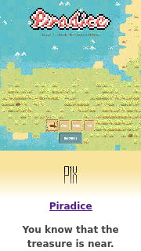

# Piradice

Turn-base strategy game in HTML5. Custom engine, vanilla JavaScript.

[PLAY ONLINE](https://piradice.p1x.in/), [Support at itch.io](https://w84death.itch.io/piradice)

## Story

In times of long journeys there were the moments of courage and curiosity. This story begins simple. With one ship and a bunch of other pirates like you right in the middle of an ocean.

Weeks and weeks has passed but the time has come. You know that the treasure is near. You feel it in Your wooden leg every morning stronger. And today is the day.

You found the island!

But soon You'll find out You were not the first..

## Why you should play?

- Pure turn-based strategy
- 13 unique units
- Simple gameplay
- Random procedural maps
- Web, Windows, Linux, Mac, iPad
